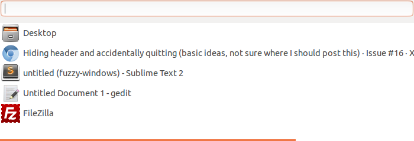

# Fuzzy Windows Documentation

Fuzzy Windows is a window switcher for GTK. It can be activated via a hotkey, upon which it shows you a list of open windows. You can find your relevant window quickly using *fuzzy searching*, similar to what you find in Sublime Text 2.



To quit Fuzzy Windows, hit `Alt+F4`.

## Feature Enhancements & Bugs

If you have a suggestion or have found a bug, please use GitHub's issue tracker to report it.


## Installation

Fuzzy Windows has been tested on Ubuntu. However, it should work under any GTK based environment.

### Requirements

Fuzzy Windows depends on GTK3+ and KeyBinder 3. You will need to install KeyBinder 3 via your operating system's package manager.

In case of Ubuntu, you can open the *Software Center* and search for `keybinder 3`, and then install it. (*Make sure you click on **show technical items** in the Software Center*)

If you're using Debian, you'll find some OS specific instructions at the bottom of this page.

### Installing

For the actual installation procedure, check out this well-written blog post by [Andrew](https://github.com/hotice): [http://www.webupd8.org/2013/07/fuzzy-window-switcher-for-ubuntu.html](http://www.webupd8.org/2013/07/fuzzy-window-switcher-for-ubuntu.html)

I'll come up with an official set of instructions soon. Till then, the above blog post should server as an excellent reference.


### Distro-Specific Instructions

Special instructions pertaining to specific distros would be mentioned here.


#### Debian Wheezy

Debian doesn't currently come with keybinder-3.0, so to backport you'll have to follow a slight variation on [the normal backporting procedure](http://wiki.debian.org/SimpleBackportCreation): Using Ubuntu 13.04 as the source instead of e.g. Debian testing or unstable.

```
# From http://packages.ubuntu.com/source/raring/keybinder-3.0
dget http://archive.ubuntu.com/ubuntu/pool/universe/k/keybinder-3.0/keybinder-3.0_0.3.0-0ubuntu1.dsc
dpkg-source -x keybinder-3.0_0.3.0-0ubuntu1.dsc 
cd keybinder-3.0-0.3.0/

# Here I typically add ~frenzie to my own packages.
debchange -R

# Check if you're missing something.
dpkg-checkbuilddeps

# I had to install these. You might need more.
sudo apt-get install libgirepository1.0-dev gobject-introspection

# And build the package.
dpkg-buildpackage -us -uc
cd ..

# We're done, install.
sudo dpkg -i *.deb

```

*- Thanks to [Frenzie](https://github.com/Frenzie) for these instructions*

#### Arch Linux

Fuzzy Windows can be found in the [AUR](https://aur.archlinux.org/packages/fuzzy-window-switcher-git/)


## Configuration

Fuzzy Windows can be configured by creating a config file. The config file can be present in the following locations:

1. ~/.config/fuzzy-windows.conf
1. ~/.config/.fuzzy-windows
1. ~/fuzzy-windows.conf
1. ~/.fuzzy-windows

The config file, if present, should at least contain the following boilerplate.

```
[DEFAULT]

```

The following items can be configured:

### 1. Hotkey

The default hotkey is `F10`. However, if you want to change it, you can do it as follows:

```
[DEFAULT]
hotkey=F9
```

Or if you want to use the Control key, for example:

```
[DEFAULT]
hotkey=<Ctrl>w
```

Or the scroll lock:

```
[DEFAULT]
hotkey=Scroll_Lock
```

### 2. Ignored Window Titles

There may be some system-specific windows that you might not want to show up on the list of windows. You can specify this by specifying regexes of the window titles that should be ignored as follows:

```
[DEFAULT]
hotkey=F10
ignored_windows=
    ^unity-panel$
    ^unity-dash$
```

Notice how the list of windows are newline separated. If you want an exact match, enclose your title inside `^$`. Also, make sure you escape special characters in regexes.

### 3. Always Show Window Titles

Similar to ignored window titles, you can make some windows always show if they match the regexes you specify. This takes the higest precedence.

```
[DEFAULT]
hotkey=F10
always_show_windows=
    Sublime Text 2$
```

### 4. Show/Hide Specific Window Types

By default, Fuzzy Windows will show all types of windows. You can choose to ignore an entire type of window, like Dock, if you wish. Here's how you'd do it for all types of windows:

```
show_windows_normal=0
show_windows_desktop=0
show_windows_dock=0
show_windows_dialog=0
show_windows_toolbar=0
show_windows_menu=0
show_windows_utility=0
show_windows_splashscreen=0
```

If a window matches any regex of the `always_show_windows` option, then it will be shown regardless of whether the actual window type is ignored.

